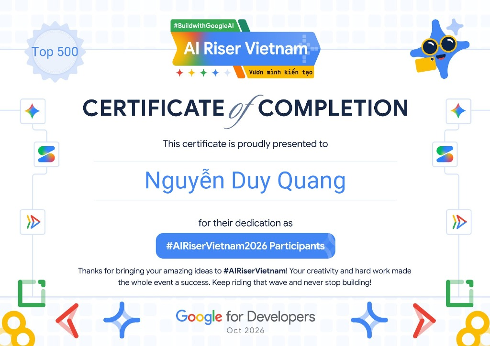

# 🍵 Nguyễn Duy Quang (Quang có Gờ) - Interactive 3D Matcha Profile

> **Top 500 AI Riser Vietnam 2026 • Google for Developers**  
> **Kaggle 5-Day GenAI & AI Agents Certified**  
> **Giải Nhất STEM KHKT 2026 • Giải Ba KHKT Cấp Thành Phố Đà Nẵng 2026**



---

## 🌟 Tính Năng Nổi Bật

- 🐾 **Mascot 3D Mèo Mướp Matcha Cầm Ly Latte**: Chú mèo mướp sọc xanh matcha ôm ly latte bọt sữa 3D, mắt mèo anime lấp lánh, vẫy đuôi mềm mại và biểu cảm phản hồi tương tác theo cuộn chuột, chạm tay (Mobile Touch UX) và nghiêng con quay hồi chuyển (gyroscope).
- 🪐 **Vũ Trụ Lập Trình (Coding Cosmos 3D)**: Hệ thống 10 hành tinh huy hiệu 3D bay quanh chú mèo (VS Code, Python, React, TypeScript, Google AI, Kaggle, PyTorch, Docker, SQL, GitHub) với hiệu ứng vát kim loại metallic và bụi sao stardust.
- 📱 **Hộp Thoại Liên Hệ 1-Chạm (Smart Contact Modal)**: Giải quyết triệt để lỗi `mailto:`/`tel:` trên Windows/Android. Hỗ trợ sao chép email/SĐT 1-click vào clipboard, mở trực tiếp trình soạn thư Gmail Web, gọi hotline và nhắn tin Zalo nhanh.
- 🏆 **Bộ Sưu Tập Thành Tựu Danh Giá**: Tích hợp danh hiệu Top 500 AI Riser Việt Nam, Kaggle 5-Day Vibe Coding, STEM 2026 với modal xem chứng chỉ chi tiết (Lightbox).
- 🍵 **Mini Game Pha Trà Matcha 3D**: Khu vực game pha trà tương tác thư giãn.

---

## 🚀 Hướng Dẫn Chạy Cục Bộ (Local Development)

```bash
# Cài đặt thư viện phát triển
npm install

# Khởi chạy dev server với Vite
npm run dev

# Hoặc mở trực tiếp file index.html trên bất kỳ trình duyệt nào
```

---

## 🌐 Triển Khai Lên GitHub Pages (Deployment)

Dự án được cấu trúc tương thích 100% với môi trường web tĩnh:
1. Vào repository trên GitHub: `https://github.com/Wothing0406/DuyQuang`
2. Chọn **Settings** -> **Pages**
3. Ở mục **Build and deployment**:
   - **Source**: Chọn `Deploy from a branch`
   - **Branch**: Chọn `main` và thư mục `/ (root)`
4. Nhấn **Save**. Website sẽ tự động xuất bản tại địa chỉ:
   👉 **`https://wothing0406.github.io/DuyQuang/`**

---

© 2026 Nguyễn Duy Quang (Quang có Gờ). All rights reserved.
